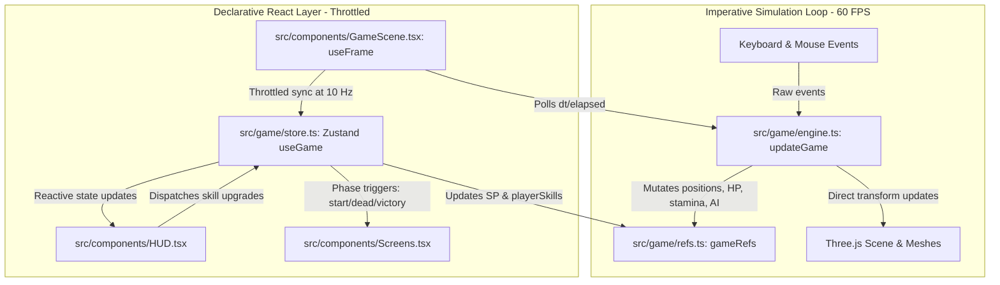

# Codebase Analysis: Beyond the Last Horizon ("The Last Survivor")

> **Purpose**: This document serves as a comprehensive architectural and functional overview of the repository. Referencing this summary saves context and token overhead during development conversations and code modifications.

---

## 1. Project Overview & Tech Stack

**Beyond the Last Horizon** (internally titled *The Last Survivor*) is a 3D browser-based post-apocalyptic action RPG platformer and survival game built with modern React, Three.js, and TypeScript.

### Tech Stack
- **Framework & Runtime**: React 18 (`react`, `react-dom`), Vite 5 (bundler & dev server), TypeScript 5.5.
- **3D Graphics & Rendering**: Three.js (`three` r185), `@react-three/fiber` (R3F v8), `@react-three/drei` (v9).
- **State Management**: Zustand v4 (lightweight global state + imperative getters/setters).
- **Styling**: Tailwind CSS v3, PostCSS, Lucide React (icons).
- **Backend / Integration**: `@supabase/supabase-js` (dependency ready for future backend persistence).

---

## 2. Repository File Structure

```
Beyond-the-Last-Horizon/
├── docs/
│   └── codebase_analisys.md          # Architectural analysis & developer guide
├── src/
│   ├── components/
│   │   ├── GameScene.tsx             # Main 3D Canvas scene, lights, R3F loops, input event listeners
│   │   ├── HUD.tsx                   # In-game HUD, survival stat bars, XP, overlays, skill modal
│   │   ├── PlayerMesh.tsx            # Procedural 3D humanoid character mesh & night-vision point light
│   │   └── Screens.tsx               # StartScreen, DeathScreen (with cause), VictoryScreen
│   ├── game/
│   │   ├── constants.ts              # Balance tuning, player/enemy stats, cycle timers, XP math, helper fns
│   │   ├── engine.ts                 # Imperative 60 FPS physics, collisions, AI, combat, gathering, daylight
│   │   ├── levelGen.ts               # Deterministic procedural level & platform generator (mulberry32 PRNG)
│   │   ├── refs.ts                   # High-frequency mutable refs shared between Three.js & HUD polling
│   │   ├── store.ts                  # Zustand global store: game phase, level state, skill dispatcher, HUD mirror
│   │   └── types.ts                  # TypeScript interfaces: LevelData, PlatformData, EnemyRT, Skills, etc.
│   ├── App.tsx                       # Root view: Three.js Canvas setup, tone mapping, fog, HUD & Screen layering
│   ├── index.css                     # Tailwind directives, canvas crosshair, user-select disable
│   ├── main.tsx                      # React root entrypoint
│   └── vite-env.d.ts                 # Vite client types
├── eslint.config.js                  # ESLint flat config
├── package.json                      # Dependencies and npm scripts
├── postcss.config.js                 # PostCSS setup for Tailwind
├── tailwind.config.js                # Tailwind CSS styling configuration
├── tsconfig.json / tsconfig.app.json # TypeScript compiler configuration
└── vite.config.ts                    # Vite config with '@' alias pointing to '/src'
```

---

## 3. Core Architecture & High-Performance Paradigm

The codebase implements a **hybrid architecture** that avoids React re-render bottlenecks during high-frequency 60 FPS game updates:



### Key Highlights:
1. **Zero React Re-renders on Movement**: Coordinates (`playerPos`, `playerVel`), camera angles (`cameraYaw`, `cameraPitch`), and real-time status values are updated imperatively in `gameRefs`.
2. **Throttled HUD Synchronization**: `GameScene.tsx` synchronizes `gameRefs` to Zustand's `hud` slice at **10 FPS** (`Math.floor(elapsed * 10)`), while 3D Billboard labels update at **5 FPS**.
3. **Rigid Third-Person Camera**: Follows the player without smoothing lag (`lerp`), rigidly locked behind the player yaw/pitch with third-person offset (`camDist = 5`, `camHeight = 2`).

---

## 4. Subsystem Deep Dive

### 4.1. Simulation & Physics Engine (`src/game/engine.ts`)
- **Movement & Physics**:
  - Camera-relative directional movement via `WASD` / arrow keys.
  - Instant horizontal stop (no inertia/ice physics).
  - Gravity applied at `22 m/s²`.
  - Ground detection and landing via `collidePlatforms()` & `isGrounded()`.
  - Head-bonk ceiling collision and AABB horizontal push-out for obstacles taller than `1.5m`.
  - Fall-to-void death threshold: `y < groundY - 15`.
- **Survival Decay System**:
  - **Hunger Decay**: `100 / 180` units/sec (~3 minutes from full to zero). Starvation deals 4 HP/sec damage when hunger reaches 0.
  - **Stamina / Exhaustion Decay**: `100 / 240` units/sec (~4 minutes to empty). When exhausted (`exhaustion <= 0`), player speed is halved and UI applies a heavy motion blur.
  - **Sleeping (`R`)**: Instantly restores exhaustion to 100 with a 1.0s black fade transition.
- **Combat & Enemy AI**:
  - Detection range: `14m`. When detected, enemies chase player with speed scaled by enemy level (`baseSpeed: 2.2 + level * 0.15`).
  - When outside detection range, enemies smoothly navigate back to `homePos`.
  - **Player Attack (`Click` or `E`)**: Frontal 180° cone test (`toEnemy.dot(facing) >= 0.2`) within `2.2m` range.
    - If Player Level $\ge$ Enemy Level: High damage (`maxHealth / 2.5`).
    - If Under-leveled: Low damage (`maxHealth / 6`), while enemy attacks inflict lethal $\times 3.5$ multiplier.
  - **Chicken AI**: Random wandering + flee mechanic within `6m` from player. Slaying chickens replenishes `+25` Hunger.
- **Gathering (`F`)**:
  - Interacting with berry bushes restores `+18` Hunger.
  - Bushes hold 3 berries with visual mesh hiding, an 8s interaction cooldown, and 10s full respawn timer.
- **Earthquake Mechanic (Level 1 / Green Zone)**:
  - Random tremor triggers every 12–22s.
  - Unstable platforms shake for 2.0s before disappearing for 4.0s, dropping players standing on them.

---

### 4.2. Procedural Level Generation (`src/game/levelGen.ts`)
Levels are deterministically generated using a `mulberry32` PRNG seeded by `(level * 1337 + 42)`.

| Level / Biome | Subtitle | Ground Y | Sky Color | Fog Color | Level Mechanics & Features |
|---|---|---|---|---|---|
| **1. Green Zone** | Ruined City | `0` | `#3a4a2a` | `#6a7a5a` | Collapsed towers, vegetation platforms, 6 NPCs, platform earthquakes |
| **2. Desert** | Wasteland | `0` | `#c9a86a` | `#e0c890` | Wide sand dunes, elevated stone mesas, stepping stone paths |
| **3. Mountains** | Frozen Peaks | `0` | `#a0b8c8` | `#e8f0f8` | Tall narrow peak pillars (up to 14m), perilous cliff ledges |
| **4. Ocean** | Drowned World | `-0.5` | `#2a5a8a` | `#5a9ac8` | Translucent water surface ground, floating raft platforms |

**Spawn & Portal Placement**:
- Player always spawns near origin `[0, y, 0]` atop the ground platform.
- Exit portal spawns in the far corner `[32+rand*6, y, 32+rand*6]`. Reaching within `2m` triggers `advanceLevel()`.

---

### 4.3. Progression & RPG Skill Tree (`src/game/constants.ts`, `src/game/store.ts`)
- **Experience Curve**: $XP_{\text{max}} = \lfloor 100 \times 1.4^{\text{level} - 1} \rfloor$.
- Slaying enemies awards $XP = \text{level} \times 25$.
- Leveling up grants `+1 Skill Point (SP)` and heals `+20 HP`.

#### Skill Attributes:
1. **Vision (`👁`)**: Illuminates darkness during night cycles. At Night + Vision > 0, an attached `pointLight` activates with intensity and radius scaling per skill point. Reduces dark vignette.
2. **Hearing (`👂`)**: Displays radar HUD notifications whenever enemies, chickens, or harvestable bushes are within hearing range (`8 + hearing * 5` meters).
3. **Speed (`🏃`)**: Increases player base movement speed by `+1.1` per level.
4. **Jump (`🦘`)**: Increases player jump velocity by `+1.25` per level.

---

### 4.4. Lighting, Day/Night Cycle & Visuals (`src/components/GameScene.tsx`)
- **Day / Night Duration**: Total cycle is 600s (5 min Day + 5 min Night).
- **Dynamic Sky & Lighting**:
  - `AmbientLight` lerps between `0.6` (day) and `0.08` (night).
  - `DirectionalLight` (Sun with 2048x2048 PCFSoft shadow maps) lerps from `1.2` down to `0.05`.
  - Night overlay with radial cutout shader effect in HUD depending on Vision level.
- **Procedural 3D Geometry**:
  - All entities (player, enemies, chickens, bushes, NPCs, portal) are procedurally constructed using Three.js primitives (`BoxGeometry`, `SphereGeometry`, `TorusGeometry`, `CircleGeometry`) with standard PBR materials.

---

## 5. Controls Reference

| Action | Primary Input | Secondary / Alternative |
|---|---|---|
| **Move** | `W` / `A` / `S` / `D` | Arrow Keys |
| **Look / Aim** | Mouse Movement | Requires pointer lock (click canvas) |
| **Jump** | `Space` | — |
| **Attack** | `Left Mouse Click` | `E` |
| **Gather / Harvest** | `F` | Interacts with bushes |
| **Sleep / Rest** | `R` | Restores 100% Stamina |
| **Open/Close Skills** | `K` | `Tab` (toggles pointer lock & pauses game) |

---

## 6. Build, Scripts & Tooling

```bash
# Start local development server (Vite)
npm run dev

# Run TypeScript typecheck without emitting output
npm run typecheck

# Lint codebase with ESLint flat config
npm run lint

# Build optimized production bundle
npm run build

# Preview production build locally
npm run preview
```

---

## 7. Developer Cheatsheet & Extension Guidelines

### Adding New Enemies or Biomes
- Add biome definitions to `BIOMES` array in `src/game/constants.ts`.
- Add level configuration (colors, enemy counts, layouts) to `CONFIGS` in `src/game/levelGen.ts`.
- Extend `EnemyKind` union in `src/game/types.ts`.

### Modifying Physics or Player Stats
- Update base speeds, jump heights, health, hunger rates in `PLAYER` or `SKILL` objects in `src/game/constants.ts`.
- Physics resolution rules are centralized in `collidePlatforms()` inside `src/game/engine.ts`.

### Rules for High-Frequency State
- ⚠️ **Never** update Zustand state every frame in `useFrame()` — this will cause severe React lag.
- **Always** write high-frequency changes into `gameRefs` in `src/game/refs.ts`.
- Use `syncHUD()` in `src/game/store.ts` for periodic (100ms) UI updates.
