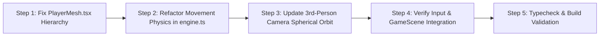

# Implementation Plan: Character Movement & Third-Person Camera Correction

> **Target File**: `Docs/implementation_plans/corecting_the_character_movment.md`  
> **Status**: Ready for Execution  
> **References**: [`docs/codebase_analisys.md`](file:///docs/codebase_analisys.md)

---

## 1. Problem Statement & Root Cause Analysis

### 1.1 The Issues
1. **Character Disappears / Runs Off-Screen**: When the player presses movement keys, the character model drifts away from the camera at double speed in an orbital trajectory and quickly disappears off-screen.
2. **Camera Desynchronization**: The third-person camera does not rigidly maintain the centered perspective behind the protagonist.
3. **Movement & Aim Desync**: Movement vectors and character body rotation do not strictly follow the mouse look direction and camera-relative axes.

### 1.2 Root Causes Identified
- **Transform Duplication in Component Hierarchy**:
  In [`src/components/GameScene.tsx`](file:///src/components/GameScene.tsx), the player is instantiated as `<group ref={playerRef}><PlayerMesh /></group>`. In [`src/game/engine.ts`](file:///src/game/engine.ts), `updateGame()` sets `playerRef.position.copy(gameRefs.playerPos)` and `playerRef.rotation.y = yaw`. Simultaneously, inside [`src/components/PlayerMesh.tsx`](file:///src/components/PlayerMesh.tsx), an internal `useFrame` was ALSO doing `groupRef.current.position.copy(gameRefs.playerPos)`. Because `PlayerMesh` is nested inside `playerRef`, its effective world coordinate was:
  $$\vec{P}_{\text{world}} = \vec{P}_{\text{playerRef}} + \mathbf{R}_{\text{yaw}} \cdot \vec{P}_{\text{PlayerMesh}} = \vec{P}_{\text{pos}} + \mathbf{R}_{\text{yaw}} \cdot \vec{P}_{\text{pos}}$$
  This doubled horizontal movement speed and caused severe orbital drift when turning.
- **Incomplete Spherical Pitch Orbit Math**:
  In `engine.ts`, camera height added pitch linearly without scaling the horizontal orbit radius by $\cos(\text{pitch})$, causing warping and pitch distortion when looking up or down.
- **Redundant Lights & Transforms**:
  `PlayerMesh.tsx` contained an unused secondary `<pointLight>` with fixed zero intensity, while the active point light was already managed in `GameScene.tsx`.

---

## 2. Architectural Design & Movement Specifications

Based on the validated design choices:
1. **Aim / Strafe Style Controls**:
   - The protagonist girl's body strictly faces the mouse aim direction (`cameraYaw`).
   - Pressing **`W`** moves the character forward in the exact camera look direction.
   - Pressing **`S`** backpedals towards the camera.
   - Pressing **`A`** strafes left relative to camera view.
   - Pressing **`D`** strafes right relative to camera view.
2. **Responsive Physics with Zero Drift**:
   - Instant response on key press.
   - Immediate stop when keys are released (`vel.x = 0`, `vel.z = 0`), eliminating slippery inertia or deceleration lag.
3. **Standard 3rd-Person Centered Camera**:
   - Camera follows the player at a fixed offset (5.0 units back, 2.5 units up) with zero frame delay.
   - Spherical coordinates calculate exact orbit position using `yaw` and clamped `pitch`.
   - Synchronously executes `camera.lookAt(player.x, player.y + 1.2, player.z)` on every frame, keeping the character torso/head perfectly centered.

---

## 3. Step-by-Step Implementation Plan

### Step 1: Fix `src/components/PlayerMesh.tsx`
- **Action**:
  1. Remove the duplicate `useFrame` hook that copies `gameRefs.playerPos`.
  2. Remove the redundant inactive `<pointLight>`.
  3. Anchor all procedural geometry relative to the local origin `(0, 0, 0)` at feet level ($y = 0$, character height $1.4\text{m}$).
  4. Ensure front of character faces $-Z$ (Three.js standard forward) so that body orientation matches `rotation.y = cameraYaw`.

### Step 2: Refactor Movement Physics in `src/game/engine.ts`
- **Action**:
  1. Recalculate camera-relative unit vectors:
     $$\vec{F} = \text{normalize}\begin{pmatrix} -\sin(\text{yaw}) \\ 0 \\ -\cos(\text{yaw}) \end{pmatrix}, \quad \vec{R} = \text{normalize}\begin{pmatrix} \cos(\text{yaw}) \\ 0 \\ -\sin(\text{yaw}) \end{pmatrix}$$
  2. Map WASD and arrow keys to directional accumulation:
     $$\vec{M} = \sum (\text{W} \to +\vec{F}, \text{S} \to -\vec{F}, \text{D} \to +\vec{R}, \text{A} \to -\vec{R})$$
  3. Implement tight deadzone & instant stop:
     - If $|\vec{M}| > 0.0001$: $\vec{V}_{\text{horiz}} = \text{normalize}(\vec{M}) \times \text{Speed}$.
     - Else: $V_x = 0, V_z = 0$.
  4. Apply gravity ($22\,\text{m/s}^2$) and jump mechanics ($7\,\text{m/s}$ base).
  5. Bind character mesh transform:
     - `playerMesh.position.copy(gameRefs.playerPos)`
     - `playerMesh.rotation.y = gameRefs.cameraYaw`

### Step 3: Implement Rigid Spherical 3rd-Person Camera in `src/game/engine.ts`
- **Action**:
  1. Define orbit parameters:
     - `camDist = 5.0`
     - `camHeight = 2.5`
     - `pitch` clamped to `[-0.8, 0.6]` radians.
  2. Compute horizontal and vertical orbit components:
     $$D_h = \text{camDist} \times \cos(\text{pitch})$$
     $$D_v = \text{camHeight} + \text{camDist} \times \sin(\text{pitch})$$
  3. Compute camera coordinates:
     $$\text{camX} = \text{playerPos.x} + \sin(\text{yaw}) \cdot D_h$$
     $$\text{camY} = \text{playerPos.y} + D_v$$
     $$\text{camZ} = \text{playerPos.z} + \cos(\text{yaw}) \cdot D_h$$
  4. Synchronously execute:
     - `camera.position.set(camX, camY, camZ)`
     - `camera.lookAt(playerPos.x, playerPos.y + 1.2, playerPos.z)`

### Step 4: Verify Input & GameScene Integration in `src/components/GameScene.tsx`
- **Action**:
  1. Confirm mouse sensitivity (`sens = 0.0025`) and pitch clamping in mouse move event handler.
  2. Verify pointer lock listeners and auto re-locking on skill menu close.
  3. Ensure active night vision `pointLight` is positioned at `[0, 1.2, 0]` relative to `playerRef`.

### Step 5: Typecheck & Build Validation
- **Action**:
  1. Run `npm run typecheck` to guarantee zero TypeScript compiler errors.
  2. Run `npm run lint` to verify code quality.
  3. Run `npm run build` to ensure clean production build without bundle warnings.

---

## 4. Verification & Testing Checklist

| Test Scenario | Expected Outcome | Verification Method |
|---|---|---|
| **Forward Movement (`W`)** | Character moves away from camera into the screen; camera smoothly tracks | Press and hold `W` |
| **Backward Movement (`S`)** | Character moves towards camera (backpedal); camera maintains distance | Press and hold `S` |
| **Strafing Left (`A`) / Right (`D`)** | Character strafes left/right relative to screen while facing forward | Press `A` and `D` |
| **Diagonal Movement (`W+D`, `W+A`)** | Character moves at constant normalized speed (no diagonal speed boost) | Press dual keys |
| **Instant Stop** | Character stops immediately on key release without sliding | Release keys at high speed |
| **Mouse Look (Yaw & Pitch)** | Character body turns with mouse; camera orbits without clipping or distortion | Move mouse 360° and up/down |
| **Jumping (`Space`)** | Character jumps up from ground; collision detection works seamlessly | Press `Space` while moving |
| **Void Fall** | Falling off platforms triggers death screen with 'You fell into the void' | Walk off platform edge |
| **Level Progression** | Reaching the portal advances to next biome with character spawn reset | Walk into glowing portal |

---

## 5. Summary of Modified Files

- [`src/components/PlayerMesh.tsx`](file:///src/components/PlayerMesh.tsx): Remove duplicate `useFrame` transform & redundant point light.
- [`src/game/engine.ts`](file:///src/game/engine.ts): Implement camera-relative movement math, instant stopping, and spherical 3rd-person camera positioning.
- [`src/components/GameScene.tsx`](file:///src/components/GameScene.tsx): Verify pointer lock and lighting hierarchy.
