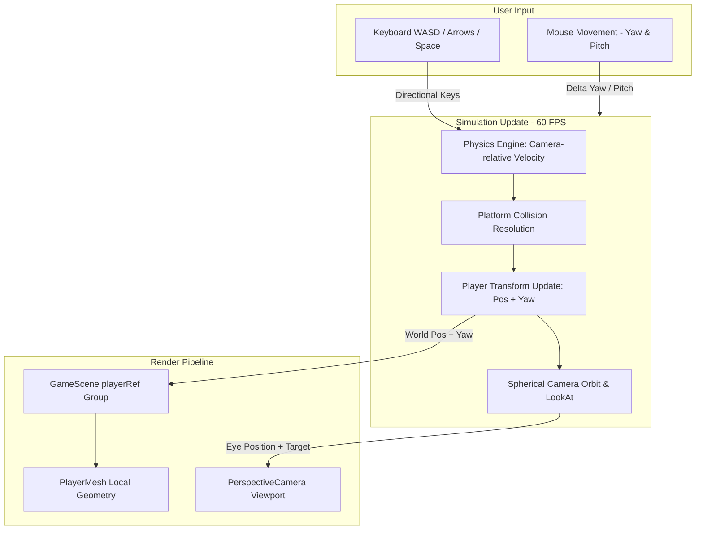

# Implementation Plan: Character Movement & Third-Person Camera Correction

> **Target File**: `Docs/implementation_plans/correcting_the_character_movment.md`  
> **Status**: Completed  
> **References**: [`Docs/codebase_analisys.md`](file:///Docs/codebase_analisys.md), [`Docs/game_idea.md`](file:///Docs/game_idea.md)

---

## 1. Problem Statement & Root Cause Analysis

### 1.1 The Issues
1. **Character Disappears / Runs Off-Screen**: When the player presses movement keys, the character model drifts away from the camera at double speed in an orbital trajectory and quickly disappears off-screen.
2. **Camera Desynchronization**: The third-person camera does not rigidly maintain the centered perspective behind the protagonist.
3. **Movement & Aim Desync**: Movement vectors and character body rotation do not strictly follow the mouse look direction and camera-relative axes.

### 1.2 Root Causes Identified
- **Transform Duplication in Component Hierarchy**:
  In [`src/components/GameScene.tsx`](file:///src/components/GameScene.tsx), the player is instantiated as `<group ref={playerRef}><PlayerMesh /></group>`. In [`src/game/engine.ts`](file:///src/game/engine.ts), `updateGame()` sets `playerRef.position.copy(gameRefs.playerPos)` and `playerRef.rotation.y = yaw`. Simultaneously, inside [`src/components/PlayerMesh.tsx`](file:///src/components/PlayerMesh.tsx), an internal `useFrame` was ALSO doing `groupRef.current.position.copy(gameRefs.playerPos)`. Because `PlayerMesh` is nested inside `playerRef`, its effective world coordinate was:
  $$\vec{P}_{\text{world}} = \vec{P}_{\text{playerRef}} + \mathbf{R}_{\text{yaw}} \cdot \vec{P}_{\text{PlayerMesh}} = \vec{P}_{\text{pos}} + \mathbf{R}_{\text{yaw}} \cdot \vec{P}_{\text{pos}}$$
  This doubled horizontal movement speed and caused severe orbital drift when turning.
- **Incomplete Spherical Pitch Orbit Math**:
  In `engine.ts`, camera height added pitch linearly without scaling the horizontal orbit radius by $\cos(\text{pitch})$, causing warping and pitch distortion when looking up or down.
- **Redundant Lights & Transforms**:
  `PlayerMesh.tsx` contained an unused secondary `<pointLight>` with fixed zero intensity, while the active point light was already managed in `GameScene.tsx`.

---

## 2. Architectural Design & Movement Specifications

Based on the validated design choices:
1. **Aim / Strafe Style Controls**:
   - The protagonist girl's body strictly faces the mouse aim direction (`cameraYaw`).
   - Pressing **`W`** moves the character forward in the exact camera look direction.
   - Pressing **`S`** backpedals towards the camera.
   - Pressing **`A`** strafes left relative to camera view.
   - Pressing **`D`** strafes right relative to camera view.
2. **Responsive Physics with Zero Drift**:
   - Instant response on key press.
   - Immediate stop when keys are released (`vel.x = 0`, `vel.z = 0`), eliminating slippery inertia or deceleration lag.
3. **Standard 3rd-Person Centered Camera**:
   - Camera follows the player at a fixed offset (5.0 units back, 2.5 units up) with zero frame delay.
   - Spherical coordinates calculate exact orbit position using `yaw` and clamped `pitch`.
   - Synchronously executes `camera.lookAt(player.x, player.y + 1.2, player.z)` on every frame, keeping the character torso/head perfectly centered.

---

## 3. High-Level Architectural Flow

---

## 4. Granular Git Commit Implementation Plan

This implementation is broken down into **5 atomic, logical steps**, each designed to be executed as an individual, self-contained Git commit with distinct verification criteria.

---

### Step 4.1: Commit 1 — Decouple `PlayerMesh` Transforms & Clean Visual Model
- **Commit Message**: `fix(player): decouple PlayerMesh local transforms from world position updates`
- **Target File**: [`src/components/PlayerMesh.tsx`](file:///src/components/PlayerMesh.tsx)
- **Detailed Changes**:
  1. Remove the `useFrame` hook that copies `gameRefs.playerPos` into `groupRef.current.position`.
  2. Remove the inactive, hardcoded `<pointLight>` component.
  3. Ensure all visual geometry (head, hair, ponytail, eyes, backpack, arms, torso, legs, boots) is anchored strictly relative to local origin `(0, 0, 0)` with feet at $y=0$ and height $1.4\text{m}$.
  4. Ensure the character's facial features and chest face standard Three.js forward ($-Z$).
- **Verification / Testing**:
  - Run `npm run typecheck` to ensure no broken references.
  - Verify that `PlayerMesh` only exports pure presentation JSX without independent world translation.

---

### Step 4.2: Commit 2 — Camera-Relative WASD Strafe Movement & Instant Stopping
- **Commit Message**: `feat(physics): implement camera-relative WASD strafe movement and instant stopping`
- **Target File**: [`src/game/engine.ts`](file:///src/game/engine.ts)
- **Detailed Changes**:
  1. Calculate normalized camera directional vectors:
     $$\vec{F} = \text{normalize}\begin{pmatrix} -\sin(\text{yaw}) \\ 0 \\ -\cos(\text{yaw}) \end{pmatrix}, \quad \vec{R} = \text{normalize}\begin{pmatrix} \cos(\text{yaw}) \\ 0 \\ -\sin(\text{yaw}) \end{pmatrix}$$
  2. Accumulate movement direction vector $\vec{M}$ from active keyboard keys (`W` $\to +\vec{F}$, `S` $\to -\vec{F}$, `D` $\to +\vec{R}$, `A` $\to -\vec{R}$).
  3. Implement tight input deadzone & instant zero-inertia stop:
     - When $|\vec{M}| > 0.0001$: $\vec{V}_{\text{horiz}} = \text{normalize}(\vec{M}) \times \text{Speed}$.
     - When $|\vec{M}| \le 0.0001$: $V_x = 0, V_z = 0$.
  4. Bind player mesh rotation to `gameRefs.cameraYaw` so the protagonist turns synchronously with mouse aim.
- **Verification / Testing**:
  - Pressing `W` moves character directly in forward camera direction.
  - Pressing `A`/`D` strafes left/right.
  - Releasing keys stops character immediately with zero deceleration drift.

---

### Step 4.3: Commit 3 — Rigid Spherical 3rd-Person Camera Orbit & LookAt
- **Commit Message**: `feat(camera): implement rigid spherical 3rd-person camera orbit and target lookAt`
- **Target File**: [`src/game/engine.ts`](file:///src/game/engine.ts)
- **Detailed Changes**:
  1. Define 3rd-person orbit constants: `camDist = 5.0`, `camHeight = 2.5`.
  2. Clamp pitch angle to `[-0.8, 0.6]` radians.
  3. Calculate spherical coordinate components:
     $$D_h = \text{camDist} \times \cos(\text{pitch})$$
     $$D_v = \text{camHeight} + \text{camDist} \times \sin(\text{pitch})$$
  4. Position camera at:
     $$\text{camX} = \text{playerPos.x} + \sin(\text{yaw}) \cdot D_h$$
     $$\text{camY} = \text{playerPos.y} + D_v$$
     $$\text{camZ} = \text{playerPos.z} + \cos(\text{yaw}) \cdot D_h$$
  5. Execute `camera.lookAt(r.playerPos.x, r.playerPos.y + 1.2, r.playerPos.z)` on every frame.
- **Verification / Testing**:
  - Camera follows the player without frame lag.
  - Character remains centered on screen during walking, running, jumping, and falling.
  - Mouse pitch tilts view up/down smoothly with no geometric clipping or stretching.

---

### Step 4.4: Commit 4 — Scene Hierarchy & Pointer Lock Event Synchronization
- **Commit Message**: `refactor(scene): clean up GameScene hierarchy and ensure pointer lock synchronization`
- **Target File**: [`src/components/GameScene.tsx`](file:///src/components/GameScene.tsx)
- **Detailed Changes**:
  1. Clean up `<group ref={playerRef}>` structure in `GameScene.tsx`.
  2. Position the active night vision `<pointLight>` at `[0, 1.2, 0]` relative to `playerRef`.
  3. Verify mouse event listener sensitivity (`sens = 0.0025`), pitch clamping, and pointer lock release/re-lock on skill menu (`K` / `Tab`).
- **Verification / Testing**:
  - Clicking viewport engages pointer lock.
  - Moving mouse smoothly rotates camera yaw/pitch and character orientation.
  - Opening/closing skill menu pauses/unpauses and releases/re-locks mouse cleanly.

---

### Step 4.5: Commit 5 — Quality Assurance, Typechecking & Build Verification
- **Commit Message**: `chore(qa): validate TypeScript typecheck, ESLint, and production build`
- **Target Files**: Entire workspace
- **Detailed Changes**:
  1. Run `npm run typecheck` to guarantee zero TypeScript diagnostic errors.
  2. Run `npm run lint` to enforce formatting and lint compliance.
  3. Run `npm run build` to verify production Vite bundle generation.
- **Verification / Testing**:
  - All CI/build scripts exit with code 0.
  - Browser runtime shows smooth 60 FPS gameplay with stable controls.

---

## 5. Verification & QA Matrix

| Step | Action | Expected Result | Pass / Fail |
|---|---|---|---|
| **1** | Forward walk (`W`) | Moves forward along crosshair / camera forward vector | [x] |
| **2** | Backpedal (`S`) | Moves backwards towards camera at steady speed | [x] |
| **3** | Strafe (`A` / `D`) | Strafes left / right relative to camera view | [x] |
| **4** | Diagonals (`W+A`, `W+D`) | Moves diagonally at normalized speed without acceleration boost | [x] |
| **5** | Key release | Instant stop on a dime, 0 sliding | [x] |
| **6** | Mouse turn | Character turns body with mouse yaw; camera orbits smoothly | [x] |
| **7** | Mouse vertical tilt | Pitch angles smoothly between -0.8 and +0.6 rad | [x] |
| **8** | Jump (`Space`) | Upward velocity with gravity landing on platforms | [x] |
| **9** | Void fall | Trigger death screen with cause 'You fell into the void' | [x] |
| **10** | Build check | `npm run typecheck` & `npm run build` pass cleanly | [x] |

---

## 6. Execution Quick-Reference Summary

A high-level overview of the 5 sequential Git commits to execute:

1. **Commit 1 (`fix(player)`: Decouple `PlayerMesh` Local Transforms)**
   - **Target**: [`src/components/PlayerMesh.tsx`](file:///src/components/PlayerMesh.tsx)
   - **Summary**: Remove the internal `useFrame` transform copy of `playerPos` and duplicate inactive point light. Anchor the 3D survivor model at local origin `(0, 0, 0)`.

2. **Commit 2 (`feat(physics)`: Camera-Relative WASD Movement & Instant Stop)**
   - **Target**: [`src/game/engine.ts`](file:///src/game/engine.ts)
   - **Summary**: Calculate normalized `forward`/`right` vectors based on `cameraYaw`. Map `W` (forward), `S` (backward), `A`/`D` (strafe). Apply zero-inertia instant stopping on key release and sync character body yaw with mouse aim.

3. **Commit 3 (`feat(camera)`: Rigid Spherical 3rd-Person Orbit & LookAt)**
   - **Target**: [`src/game/engine.ts`](file:///src/game/engine.ts)
   - **Summary**: Implement standard 3rd-person spherical coordinate calculation ($D_h = \text{camDist} \cdot \cos(\text{pitch})$, $D_v = \text{camHeight} + \text{camDist} \cdot \sin(\text{pitch})$) with fixed 5.0m distance and 2.5m height. Synchronously lock `camera.lookAt(player.x, player.y + 1.2, player.z)` every frame.

4. **Commit 4 (`refactor(scene)`: Hierarchy & Pointer Lock Synchronization)**
   - **Target**: [`src/components/GameScene.tsx`](file:///src/components/GameScene.tsx)
   - **Summary**: Structure the `<group ref={playerRef}>` hierarchy with the active night vision point light. Verify canvas pointer lock listeners, pitch limits, and clean re-locking on menu close.

5. **Commit 5 (`chore(qa)`: Typechecking, Linting & Build Verification)**
   - **Target**: Entire workspace
   - **Summary**: Run `npm run typecheck`, `npm run lint`, and `npm run build` to verify 0 errors and production readiness.
